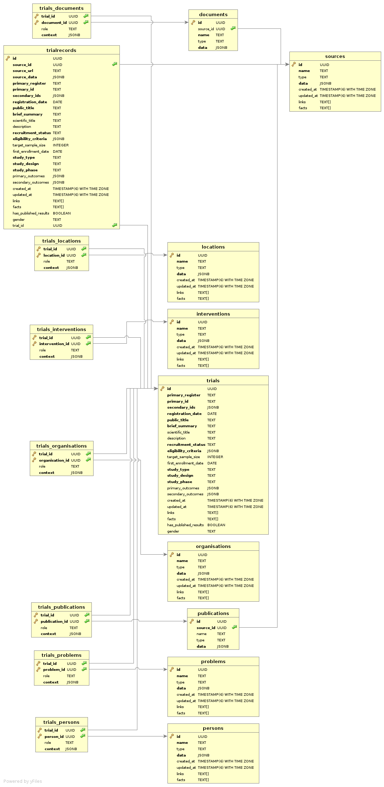

# Database

The document describes OpenTrials `database`.

> Last updated on migration: [20160415172210](https://github.com/opentrials/api/blob/master/migrations/20160415172210_remove_trials_trialrecords_table.js).

> Dump of database subset: [SQL dump](https://github.com/opentrials/api/blob/master/docs/database.sql).

## Data Model

### Basics

This `database` is based on:
> WHO Trial Registration Data Set - http://www.who.int/ictrp/network/trds/en/.

Check linked document above to have a better understaing of `database` fields.

### Tables

Meta tables:
- source - the source of the data (e.g. `nct` register)

Main tables:
- trial - main entity of the data model
- trialrecord - a trial record from `warehouse`
- publication - any publication related to a trial
- document - any document related to a trial

Reference tables:
- problem - health condition or problem studied (e.g. `cold`)
- intervention - problem influencer studied (e.g. `some drug`)
- location - any location related to a trial
- organisation - any organisation related to a trial
- person - any person related to a trial

Relationship tables:
- trial\_\* - a trial relationship

### ER Diagram

## Technology

Database engine: `postgresql-9.4+`.
